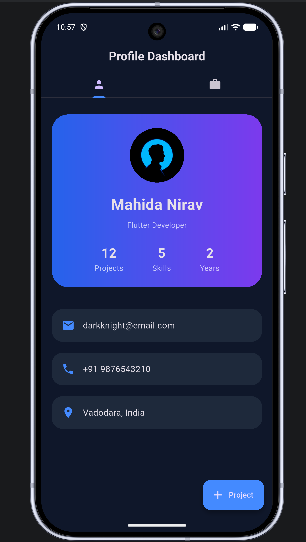
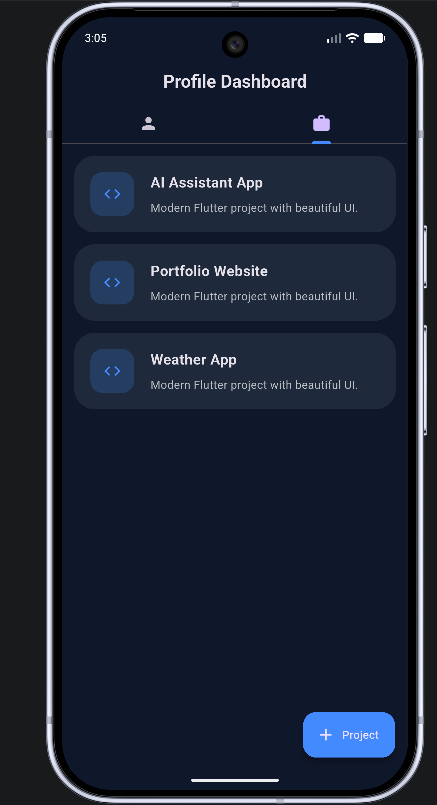
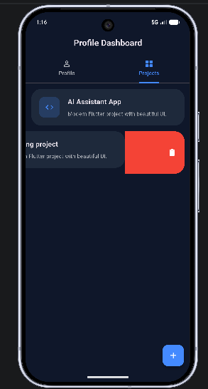

# 🚀 Profile Projects App

A modern Flutter profile dashboard application that allows users to manage projects dynamically with persistent local storage using SharedPreferences.

---

## ✨ Features

* 👤 Beautiful Profile Dashboard
* 📂 Dynamic Project Management
* ➕ Add New Projects
* 🗑️ Swipe to Delete Projects
* 💾 SharedPreferences Local Storage
* 📊 Dynamic Project Counter
* 🌙 Modern Dark Gradient UI
* 📱 Responsive Flutter Design
* 🔄 Persistent Data After App Restart

---

## 🛠️ Built With

* Flutter
* Dart
* Material Design 3
* SharedPreferences

---

## 📸 Screenshots

### Home Screen



### Projects Screen



### Delete Project



---

## 🚀 Getting Started

### Clone Repository

```bash
git clone https://github.com/TombStone88/profile-projects-app.git
```

### Install Dependencies

```bash
flutter pub get
```

### Run Application

```bash
flutter run
```

---

## 📂 Project Structure

```text
lib/
 └── main.dart

screenshots/
 ├── home.png
 ├── projects.png
 └── delete.png
```

---

## 🚀 Task 2 Enhancements

* Implemented SharedPreferences for local data persistence
* Added dynamic project creation functionality
* Added swipe-to-delete project feature
* Added automatic project count updates
* Enhanced UI with modern gradient styling
* Added user feedback using SnackBars

---

## 🎯 Learning Outcomes

* Flutter State Management
* Local Data Persistence
* SharedPreferences Integration
* Dynamic UI Updates
* Material Design 3 Components

---

## 👨‍💻 Author

**Nirav Mahida**

GitHub: https://github.com/TombStone88
